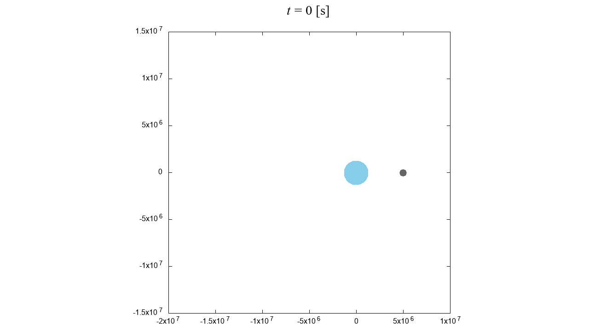

# Universal Gravitation
This gnuplot script simulates universal gravitation between the Earth and the Moon.

## Demo


## Modeling
  


<!-- ## Features
You enable to switch terminal type `qt` or `pngcairo` by using **`qtMode`**.
- If you select `qt` terminal (`qtMode==1`), gnuplot opens qt window and you can run this simulator.
The drawing speed of the qt window can be adjusted with the `pause` command and the variable `DELAY_TIME`.

- On the other hand, in `pngcairo` terminal (`qtMode!=1`), you can get a lot of PNG images of the simulation.
By using the outputted images, you can make a video or an animated GIF. -->

<!-- # Operating environment -->
## Requirement
- macOS Big Sur 12.2 / Macbook Air (M1, 2020) 16GB
- gnuplot version 5.4 patchlevel 3

<!-- # Installation -->
 
## Usage
```
git clone https://github.com/hiroloquy/universal-gravitation.git
cd universal-gravitation
gnuplot
load 'universal_gravitation.plt'
```

## Author
* Hiro Shigeyoshi
* Twitter: [@hiroloquy](https://twitter.com/hiroloquy)

### Blog
This article is written in English. You can translate it in your language.  
https://hirossoliloquy.blogspot.com/2018/10/universal-gravitation.html

### YouTube
https://youtu.be/vz9N5GG8Tfw  
[![Universal Gravitation Animation [gnuplot]](http://img.youtube.com/vi/8i3RoEP0pgw/0.jpg)](https://youtu.be/8i3RoEP0pgw "Universal Gravitation Animation [gnuplot]")

## License
"universal-gravitation" is under [MIT license](https://github.com/hiroloquy/universal-gravitation/blob/master/LICENSE).
 
